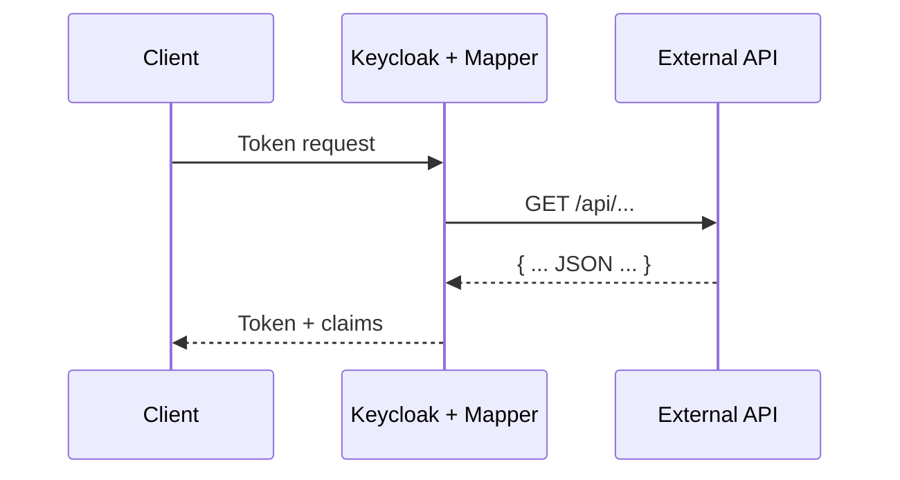
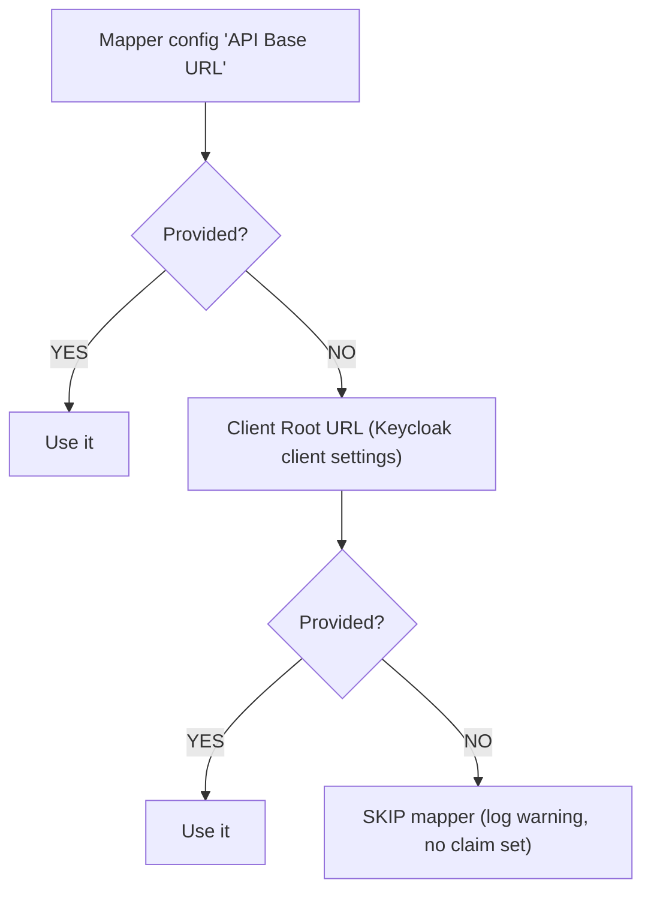
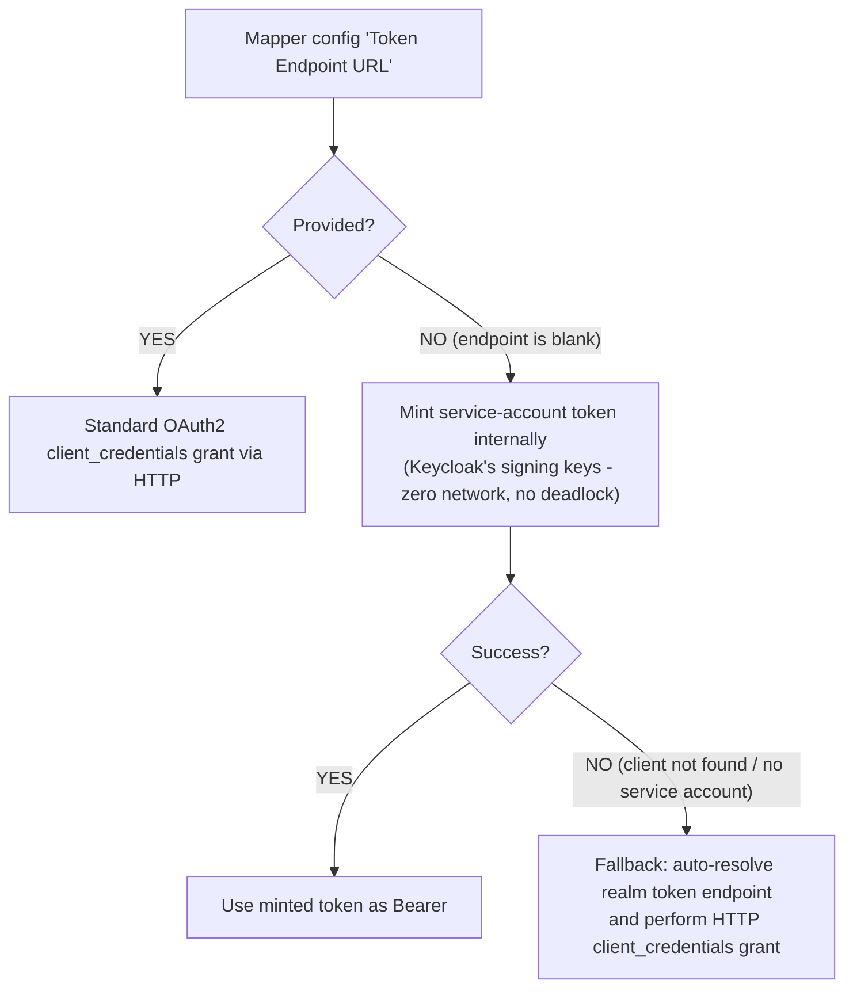

# Keycloak External Claim Mapper

A custom **Keycloak Protocol Mapper** (OIDC) that enriches access tokens, ID tokens, and userinfo responses with claims fetched from an external REST API. Responses are parsed with configurable JSONPath expressions, so the mapper works with any API shape out of the box.

The project was partially inspired by the amazing [zloom/keycloak-external-claim-mapper](https://github.com/zloom/keycloak-external-claim-mapper) and grew out of deployment scenarios where I needed more flexible authentication options - API keys with custom headers, OAuth2 client credentials, and user-token passthrough. When the external API lives behind the same Keycloak instance, the mapper can mint short-lived tokens internally using the realm's signing keys, avoiding the HTTP self-call deadlock that would otherwise occur.

## How It Works



1. A client requests a token from Keycloak.
2. During token creation the mapper calls your external API using a configurable URL + path template:****
   ```
   GET {baseUrl}{pathTemplate}
   ```
   where `{userId}`, `{username}`, `{email}`, and `{clientId}` placeholders are resolved automatically.
3. A JSONPath expression extracts the desired value from the response and injects it as a token claim.

## Project Structure

```
keycloak-external-claim-mapper/
├── pom.xml
├── docker-compose.yml
├── src/main/java/io/kritikos/keycloak/
│   ├── config/
│   │   └── ExternalClaimMapperConfig.java    # Constants & config keys
│   ├── mapper/
│   │   └── ExternalClaimProtocolMapper.java  # The SPI mapper implementation
│   ├── model/
│   │   ├── Privilege.java                    # Example model (optional)
│   │   └── PrivilegeResponse.java            # Example model (optional)
│   └── service/
│       └── ExternalClaimApiClient.java       # HTTP client for the API
├── src/main/resources/META-INF/services/
│   └── org.keycloak.protocol.ProtocolMapper  # SPI service descriptor
└── src/test/java/...                         # Unit tests
```

## Building

```bash
mvn clean package
```

The shaded JAR is produced at `target/keycloak-external-claim-mapper.jar`.

### Building with Docker (no local Maven required)

```bash
docker compose --profile build run --rm build
docker compose up
```

## Deployment

Copy the JAR into the Keycloak providers directory and rebuild:

```bash
# Quarkus-based Keycloak (v17+)
cp target/keycloak-external-claim-mapper.jar /opt/keycloak/providers/
/opt/keycloak/bin/kc.sh build

# Docker
COPY target/keycloak-external-claim-mapper.jar /opt/keycloak/providers/
```

Restart Keycloak. The mapper will appear as **"External Claim Mapper"** in the Admin Console under _Client Scopes → Mappers → Add mapper → By type_.

## Configuration (Admin Console)

| Property | Description | Default | Fallback |
|---|---|---|---|
| **API Base URL** | Root URL of the external service | _(empty)_ | Client's **Root URL** in Keycloak. If both are blank the mapper is skipped. |
| **API Path Template** | Path appended to the base URL. Supports `{userId}`, `{username}`, `{email}`, and `{clientId}` placeholders. | `/privileges?userId={userId}&clientId={clientId}` | - |
| **Token Claim Name** | Name of the claim written into the token | `app_privileges` | - |
| **Response JSONPath** | JSONPath expression applied to the API response to extract the claim value | `$.privileges[*].name` | - |
| **Authentication Mode** | How the mapper authenticates to the external API: `none`, `api_key`, `user_token`, or `client_credentials` | `client_credentials` | - |
| **API Key** | Static key value (mode = `api_key`) | _(empty)_ | - |
| **API Key Header Name** | HTTP header name used to send the API key | `X-API-Key` | - |
| **Token Endpoint URL** | OAuth2 token endpoint for the `client_credentials` grant | _(empty)_ | Auto-resolves from the current Keycloak realm. When the realm is local, an **internal service-account token** is minted using Keycloak's signing keys (zero network, no deadlock). |
| **Client ID** | OAuth2 `client_id` for the `client_credentials` grant | _(empty)_ | - |
| **Client Secret** | OAuth2 `client_secret` for the `client_credentials` grant | _(empty)_ | - |
| **Connect Timeout (ms)** | HTTP connection timeout | `5000` | - |
| **Read Timeout (ms)** | HTTP read/response timeout | `10000` | - |
| **Disable TLS Validation** | Skip TLS certificate verification (**dev only!**) | `false` | - |
| **Fail on Error** | When enabled, a failed API call or JSONPath error **blocks token issuance** (fail-closed). When disabled, the mapper silently sets an empty claim (fail-open). | `false` | - |
| **Add to ID token / access token / userinfo** | Standard OIDC toggles controlling which tokens receive the claim | toggles | - |

## Defaults & Fallbacks

### API Base URL resolution



### Token Endpoint & Authentication

When **Authentication Mode = `client_credentials`**:



### Error Handling

| Fail on Error | API call fails or returns non-2xx | JSONPath not found / error |
|---|---|---|
| `false` (default) | Empty claim set, token issued normally | Empty claim set, token issued normally |
| `true` | `RuntimeException` → token issuance **blocked** | `RuntimeException` → token issuance **blocked** |

## Example

Your API returns:
```json
{
  "userId": "abc123",
  "clientId": "my-app",
  "privileges": [
    { "name": "read:reports",  "description": "Can read reports" },
    { "name": "write:orders",  "description": "Can create orders" }
  ]
}
```

With JSONPath `$.privileges[*].name`, the resulting token claim:
```json
{
  "app_privileges": ["read:reports", "write:orders"]
}
```

## Customization

- **Change the JSONPath** – extract any shape of data from any API response (`$.roles`, `$.data.permissions`, `$.isAdmin`, etc.).
- **Add caching** – wrap `ExternalClaimApiClient.fetchClaims()` with an in-memory or distributed cache.
- **Internal token minting** – when using `client_credentials` with Keycloak as the IdP and no explicit token endpoint, the mapper mints tokens internally using Keycloak's signing keys (avoids HTTP self-call deadlock). The minted token includes `jti`, `preferred_username`, `iss`, `sub`, `aud`, `azp`, and a 60-second lifetime.

## Compatibility

| Keycloak | Java | Status |
|---|---|---|
| 22.x | 17 | Tested in CI |
| 23.x | 17 | Tested in CI |
| 24.x | 17 | Tested in CI |
| 25.x | 17 | Tested |
| 26.x | 17 | **Primary build target** |

The mapper uses the stable **ProtocolMapper SPI** (`keycloak-server-spi` / `keycloak-server-spi-private`), which has remained binary-compatible across Keycloak 22–26. A single JAR works across the entire range — no version-specific builds needed.

> **Note:** Keycloak 22 was the first Quarkus-only release with Jakarta EE. Older WildFly-based versions (< 22) are not supported.

To build against a specific Keycloak version:
```bash
mvn clean package -Dkeycloak.version=26.0.8
```

## License

Apache License 2.0
